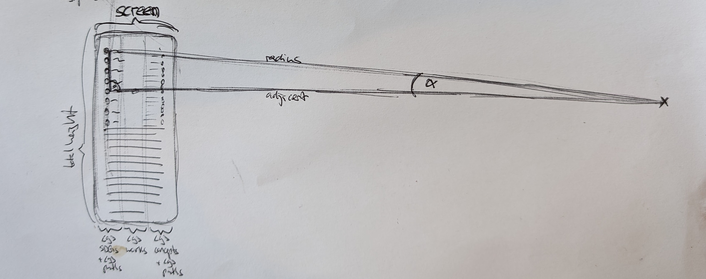

# kmapper.org

[kmapper.org](https://kmapper.org) uses the [works endpoint](https://docs.openalex.org/api-entities/works) of the [OpenAlex API](https://docs.openalex.org/) to search for gold open access articles.
It also visualizes the relevant Sustainable Development Goals and research domains assigned to the search results by OpenAlex.

This is an ongoing experiment and I welcome your feedback.

Cyrill Martin
cyrill.martin@kmapper.com

# What's Going On?

1. The search bar (TheSearch.vue) sends a GET request to the OpenAlex works endpoint
2. The mapper (mapOpenAlexWorks.js) transforms the response as needed and adds objects to the graph store (graph.js)
3. The home map (HomeMap.vue) uses the created graph objects and visualizes search results - works, assigned SDGs, and assigned research fields
4. Any click on one of the elements (works, SDGs, research fiels) triggers another mapper (createDetailsMapGraph.js) to create the input for the details map component (DetailsMap.vue) shown in a modal
5. The modal title contains a link to the actual work on OpenAlex, to the SDG linked data information of the United Nations, or the research field information on OpenAlex.

# Sketches

Sketches about the circular representation of the SDGs and research fields. A little bit of Pythagoras' theorem. 

## Big screens


## Small screens

On small screens, the radius is so big that the elements seem to be positioned in vertical alignment.



## Project Setup

### Recommended IDE Setup

[VSCode](https://code.visualstudio.com/) + [Volar](https://marketplace.visualstudio.com/items?itemName=Vue.volar) (and disable Vetur) + [TypeScript Vue Plugin (Volar)](https://marketplace.visualstudio.com/items?itemName=Vue.vscode-typescript-vue-plugin).

### Install Needed Modules

```sh
npm install
```

### Compile and Hot-Reload for Development

```sh
npm run dev
```

### Compile and Minify for Production

```sh
npm run build
```

### Compile, Minify for Production and Deploy to GitHub Pages

```sh
npm run deploy
```
