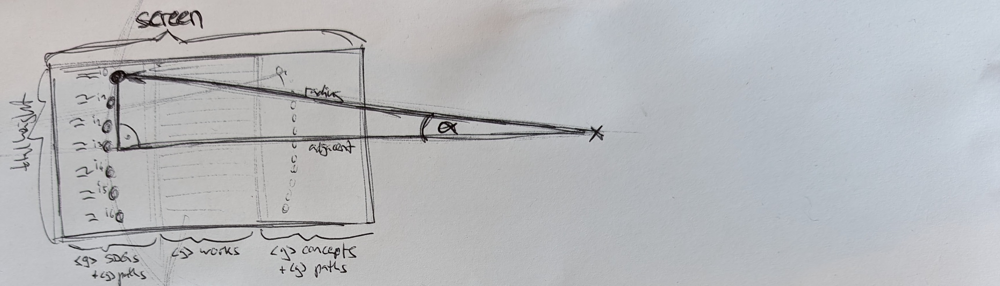

# kmapper.org

[kmapper.org](https://kmapper.org) uses the [works endpoint](https://docs.openalex.org/api-entities/works) of the [OpenAlex API](https://docs.openalex.org/) to search for gold open access articles.
It also visualizes the relevant Sustainable Development Goals and research domains assigned to the search results by OpenAlex.

This is an ongoing experiment and I welcome your feedback.

Cyrill Martin
cyrill.martin@kmapper.com

# Visualization

## Sketches about the circular representation of the SDGs and research fields




## Recommended IDE Setup

[VSCode](https://code.visualstudio.com/) + [Volar](https://marketplace.visualstudio.com/items?itemName=Vue.volar) (and disable Vetur) + [TypeScript Vue Plugin (Volar)](https://marketplace.visualstudio.com/items?itemName=Vue.vscode-typescript-vue-plugin).


## Project Setup

```sh
npm install
```

### Compile and Hot-Reload for Development

```sh
npm run dev
```

### Compile and Minify for Production

```sh
npm run build
```

### Compile, Minify for Production and deploy to GitHub Pages

```sh
npm run deploy
```